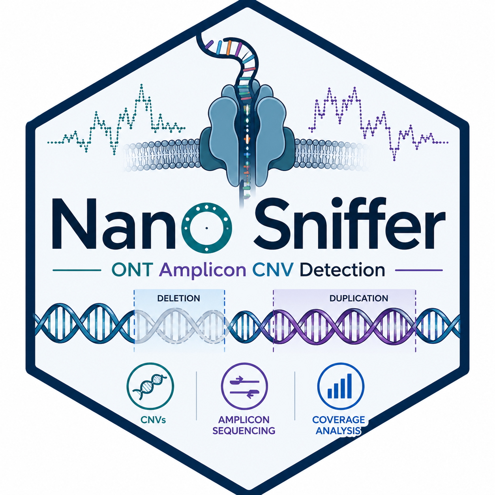

# Nano Sniffer 

Nano Sniffer is a bioinformatics tool for detecting copy number variations (CNVs) in Oxford Nanopore Technologies (ONT) amplicon sequencing data using a negative control and intra-sample normalization.

It is specifically designed for targeted regions such as TP53 and BRCA genes in long-read sequencing datasets.

**Keywords:** nanopore, ONT, CNV, amplicon sequencing, long-read sequencing, bioinformatics

---

## Contents

- [How to install and use Nano Sniffer](#how-to-install-and-use-nano-sniffer)
- [Dependencies](#-dependencies)
- [How to run](#-how-to-run)
- [Input format](#-input-format)
- [Output](#-output)
- [Notes](#-notes)

---


## How to install and use Nano Sniffer

You need to install first the required Python dependencies. The tool has been developed and tested with Python ≥ 3.9.


### 📦 Dependencies

Install all required packages using pip:
```
pip install numpy pysam scipy openpyxl
```

### 🧠 What each dependency does
- numpy → numerical computations and array handling (coverage, ratios, statistics)
- pysam → BAM file parsing and coverage extraction
- scipy → statistical tests (t-test, p-value calculations, Fisher’s method)
- openpyxl → generation of Excel reports

### ▶️ How to run

Prepare:

- a file with all BAMs to analyze (one per line)
- a negative control BAM
- a BED file with target regions

Then run:
```
python3 nano_sniffer.py \
  --input bam_list.txt \
  --neg negative_control.bam \
  --bed targets.bed \
  --output results.xlsx \
  --threads 4
```

### 📂 Input format

#### bam_list.txt
```
/path/sample1.bam
/path/sample2.bam
/path/sample3.bam
```
#### BED file
```
chr17   7572853 7572990 TP53_12_1
chr17   7572991 7573081 TP53_12_2
```

### 📊 Output

The script generates an Excel file with:

- CNV_Calls → final CNV events (filtered and merged)
- All_Targets → full per-target metrics (including neutral regions)

### ⚠️ Notes
- BAM files must be indexed (.bai)
- Designed for ONT amplicon sequencing
- Requires a negative control sample processed with the same protocol


More details about Nano Sniffer can be found in the [wiki](https://github.com/mdelcorvo/nano_sniffer/wiki).
